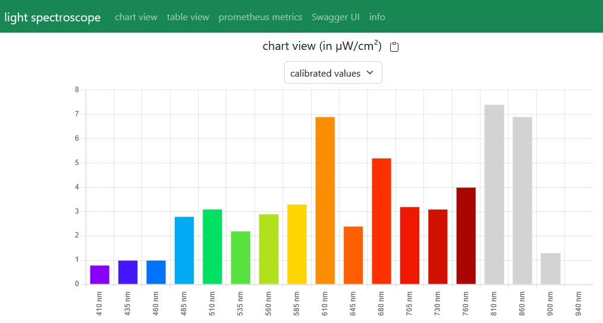
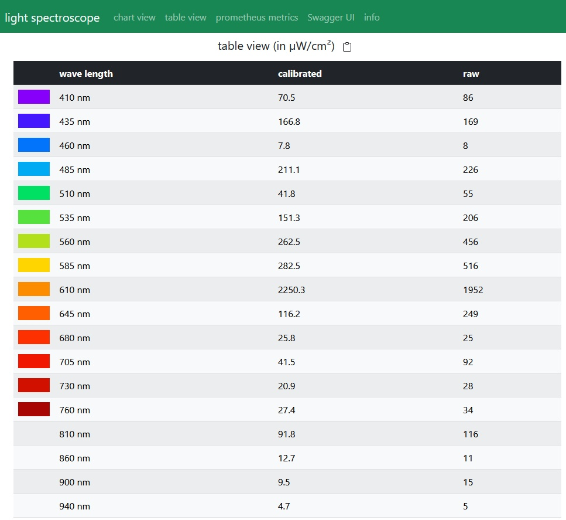
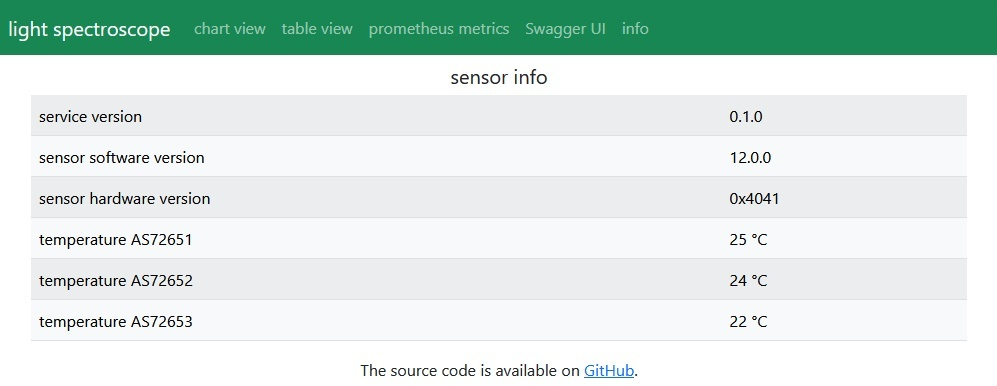

# light-spectroscope

This project implements a low cost light-spectroscope using the AS7265x sensors. It consists of the hardware described in the next chapter and a service to provide ...

* a user friendly web interface
* a REST interface to query the current values of the sensor
* a [Swagger UI](https://swagger.io/tools/swagger-ui/) to test the REST interface
* a [Prometheus](https://prometheus.io) interface to provide data to Prometheus

## Required hardware

The light-spectroscope consists of the following hardware components:

* SparkFun SEN-15050: Triad Spectroscopy Sensor - AS7265x (Qwiic)
* SparkFun DEV-14050: Serial Basic Breakout - CH340G

## Hardware installation/assembly

The [Hookup Guide](https://learn.sparkfun.com/tutorials/spectral-triad-as7265x-hookup-guide) (provided by SparkFun) explain very well how to connect the serial port to USB adapter to the sensor. The following images shows the hardware ready to use. 

## Environment variables 

The following environment variables get used by the service.

| env variable         |           |default | range  | description  |
| -------------------- | --------- | :-----: | ------ | -----------: |
| SERIAL_PORT          | mandatory |         | string | Specifies the serial port to use (e.g. "com5", "/dev/ttyUSB0").|
| LOG_LEVEL            | optional  | INFO    | "DEBUG", "INFO", "WARNING", "ERROR", "OFF"| Specifies how detailed the log output will be.|
| WEBSERVER_PORT       | optional  | 80      | positive integer | Specifies the port the webserver will use to accept incoming requests.|

## Starting the service (Docker container)

The easiest way to start the service is using docker because all you need is a Docker daemon and the rest comes with the Docker image and you do not have to install the JavaScript Runtime (Node.js) manually.

Before you can start the service in a Docker container the Docker daemon needs to get installed. Visit the [Docker website](https://www.docker.com/) for the latest installation manual.

### Linux (Docker container)

Execute `sudo docker run -it --rm --env SERIAL_PORT=<serialPort> --device <serialPort> -p <hostPort>:<containerPort> tederer/light-spectroscope` and don't forget to replace the placeholders "<...>" before executing the command.

Example: `sudo docker run -it --rm --env SERIAL_PORT=/dev/ttyUSB0 --device /dev/ttyUSB0 -p 80:80 tederer/light-spectroscope`

## Starting the service (without Docker)

To start the service without using Docker you need to clone the source code repository and build the service locally.

### Prerequisites

The following software is required to install and use the project.

* [Node.js](https://nodejs.org/en/download/)
* [Git](https://git-scm.com/download/win)

### Building the service

This section describes how to build the service locally.

#### Linux
1. execute `git clone https://github.com/tederer/light-spectroscope.git`
2. execute `cd light-spectroscope`
3. execute `npm install`
4. execute `npm run grunt`

#### Windows
1. execute `git clone https://github.com/tederer/light-spectroscope.git`
2. close the command line box
3. start `light-spectroscope/openCliHere.bat` (info: a command line box will inform you that the home folder of grunt does not exist. That's ok ... just press any key to continue)
4. execute `npm install`
5. close the command line box
6. start `light-spectroscope/openCliHere.bat`
7. execute `grunt`

### Starting the service

To start the service execute the following commands.

#### Linux

1. in a terminal open the folder "light-spectroscope"
2. export the environment variable SERIAL_PORT (e.g. "export SERIAL_PORT=/dev/ttyUSB0")
3. execute `npm start`

### Windows

1. execute `light-spectroscope/openCliHere.bat`
2. set the environment variable SERIAL_PORT (e.g. "set SERIAL_PORT=com5")
3. execute `npm start`

## User interface

To open the web based user interface of the light spectroscope service, all you need to do is open a web browser (e.g. firefox) and open the URL "http://localhost" (add the port if changed by using the environment variable WEBSERVER_PORT). The following screenshot shows the web based user interface of the light spectroscope service.

The small clipboard icon in the heading can be used to copy the data (in csv format) to the clipboard.

## References

* [AS7265x datasheet](doc/AS7265x_Datasheet.pdf)
* [Spectral Triad (AS7265x) Hookup Guide ](https://learn.sparkfun.com/tutorials/spectral-triad-as7265x-hookup-guide)
* [About SerialPort | Node SerialPort](https://serialport.io/docs/)
* [Node.js (stream documentation)](https://nodejs.org/api/stream.html#stream)
* [Node.js (line based stream reading)](https://nodejs.org/api/readline.html#readline)
* [Prometheus text based exposition format](https://prometheus.io/docs/instrumenting/exposition_formats/)
* [Prometheus metric and label naming](https://prometheus.io/docs/practices/naming/)
* [Prometheus data model](https://prometheus.io/docs/concepts/data_model/)